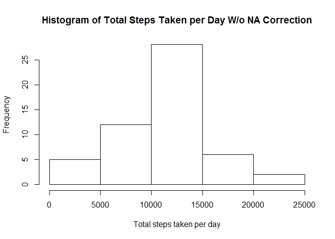
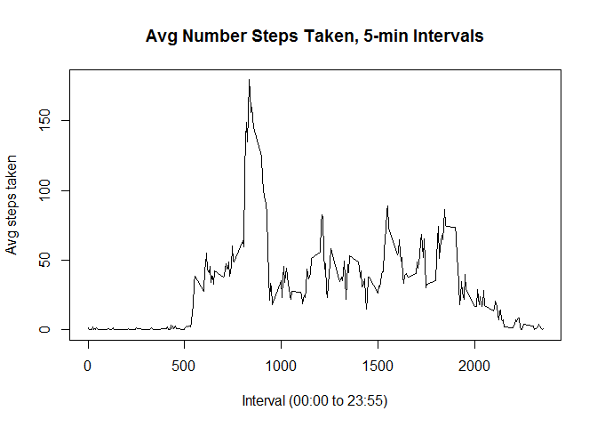
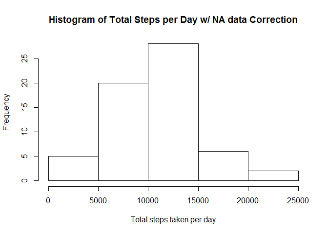
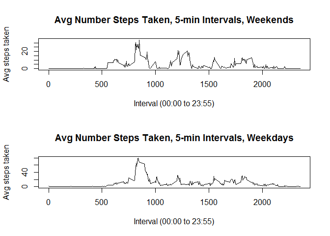

# Reproducible Research: Peer Assessment 1

## Loading and preprocessing the data


```r
##Reading Data
data5<-read.csv("activity.csv", header = TRUE)

##Processing Data
date5<-split(data5, data5$date)
```
## What is mean total number of steps taken per day? (NAs ignored)


```r
##Calculating Total Steps per Day and Making Histogram//NA's ignored
sum5<-vector(mode="numeric", length=61)
for (i in 1:61){sum5[i]<-sum(date5[[i]][1], na.rm=FALSE)}
hist(sum5,xlab="Total steps taken per day",main="Histogram of Total Steps Taken per Day W/o NA Correction")
```

 

```r
##Calculating Mean and Median Total Steps per Day//NA's ignored
print ("Mean total steps taken per day, W/o NA Correction")
```

```
## [1] "Mean total steps taken per day, W/o NA Correction"
```

```r
mean(sum5, na.rm=TRUE)
```

```
## [1] 10766.19
```

```r
print ("Median total steps taken per day, W/o NA Correction")
```

```
## [1] "Median total steps taken per day, W/o NA Correction"
```

```r
median(sum5, na.rm=TRUE)
```

```
## [1] 10765
```

## What is the average daily activity pattern?


```r
##Further Processing of Data
interval5<-split(data5, data5$interval)

##Calculating and Plotting Average Steps Taken in 5-Min Time Intervals Across All Days
mean5<-vector(mode="numeric", length=288)
for (i in 1:288){mean5[i]<-sum(interval5[[i]][1], na.rm=TRUE)/61}
plot(data5$interval[1:288],mean5,type="l", xlab="Interval (00:00 to 23:55)", ylab="Avg steps taken", main="Avg Number Steps Taken, 5-min Intervals")
```

 

```r
##Finding Time Interval with Max Average Steps
for (i in 1:288) {if (mean5[i]==max(mean5)) {print(c("Max avg steps occurs at",i, "th interval or", data5$interval[i]))}} 
```

```
## [1] "Max avg steps occurs at" "104"                    
## [3] "th interval or"          "835"
```
## Imputing missing values - using mean for the time interval

### The mean and median here are lower than when NAs ignored
### The total steps are higher in some ranges here (see histogram)

```r
##Determining Number Missing Values (NA) in Data (Steps)
k<-0
for (i in 1:17568) {if (is.na(data5$steps[i])) {k<-k+1}}
print ("Number missing values=")
```

```
## [1] "Number missing values="
```

```r
k
```

```
## [1] 2304
```

```r
##Imputing Missing Values(NAs) - Using mean for that time interval
data10<-data5
for (i in 1:17568) {if(is.na(data10$steps[i]) & trunc(288*((i/288)-(trunc(i/288))))==0) data10$steps[i]<-mean5[288]}
for (i in 1:17568) {if(is.na(data10$steps[i]) & trunc(288*((i/288)-(trunc(i/288))))!=0) data10$steps[i]<-mean5[trunc(288*((i/288)-(trunc(i/288))))]}

##Processing Imputed Data Set
date10<-split(data10, data10$date)

##Calculating Total Steps per Day and Making Histogram with Imputed Missing Values
sum10<-vector(mode="numeric", length=61)
for (i in 1:61){sum10[i]<-sum(date10[[i]][1], na.rm=FALSE)}
hist(sum10,xlab="Total steps taken per day",main="Histogram of Total Steps per Day w/ NA data Correction")
```

 

```r
##Calculating Mean and Median Total Steps per Day with Imputed Missing Values
print("Mean total steps taken per day with NA data correction")
```

```
## [1] "Mean total steps taken per day with NA data correction"
```

```r
mean(sum10, na.rm=TRUE)
```

```
## [1] 10576.27
```

```r
print("Median total steps taken per day with NA data correction")
```

```
## [1] "Median total steps taken per day with NA data correction"
```

```r
median(sum10, na.rm=TRUE)
```

```
## [1] 10395
```

## Are there differences in activity patterns between weekdays and weekends?


```r
##Adding Factor - Weekend/Weekday
data10$weekdayorend <- factor(weekdays(as.Date(data10$date)) == "Saturday" | weekdays(as.Date(data10$date)) == "Sunday")
levels(data10$weekdayorend)[levels(data10$weekdayorend)=="TRUE"] <- "weekend"
levels(data10$weekdayorend)[levels(data10$weekdayorend)=="FALSE"] <- "weekday"

##Processing Data - Weekday and Weekend Sets
data10day<-data10[data10$weekdayorend=="weekday",]
data10end<-data10[data10$weekdayorend=="weekend",]

interval10day<-split(data10day, data10day$interval)
interval10end<-split(data10end, data10end$interval)


##Calculating and Panel Plotting Avg Steps Taken in 5-Min Time Intervals
##Weekend and Weekdays Separated
mean10day<-vector(mode="numeric", length=288)
mean10end<-vector(mode="numeric", length=288)

par(mfrow=c(2,1))

for (i in 1:288){mean10end[i]<-sum(interval10end[[i]][1], na.rm=TRUE)/61}
plot(data10$interval[1:288], mean10end,type="l",xlab="Interval (00:00 to 23:55)",ylab="Avg steps taken", main="Avg Number Steps Taken, 5-min Intervals, Weekends")

for (i in 1:288){mean10day[i]<-sum(interval10day[[i]][1], na.rm=TRUE)/61}
plot(data10$interval[1:288],mean10day,type="l",xlab="Interval (00:00 to 23:55)",ylab="Avg steps taken", main="Avg Number Steps Taken, 5-min Intervals, Weekdays")
```

 


